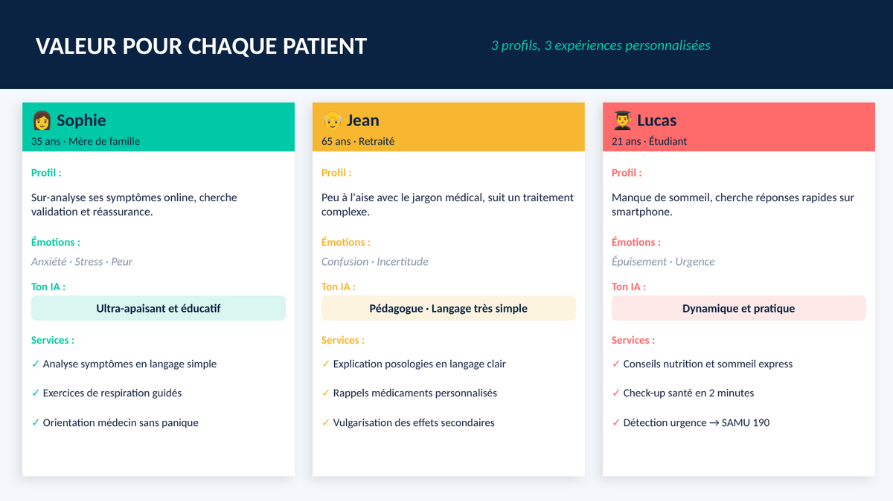
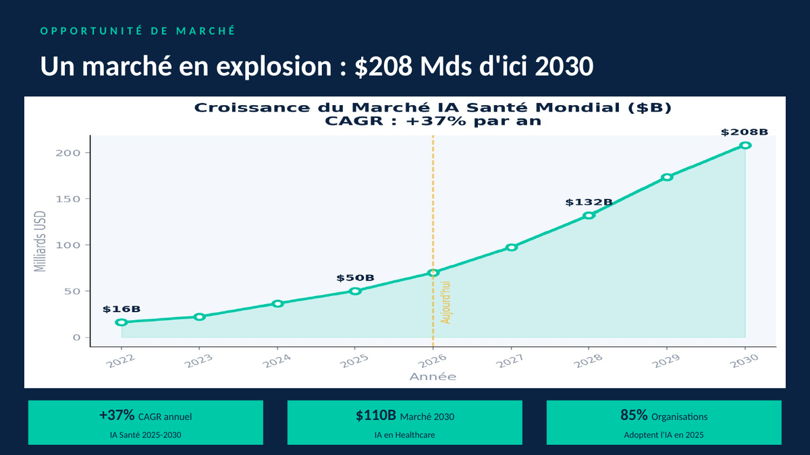
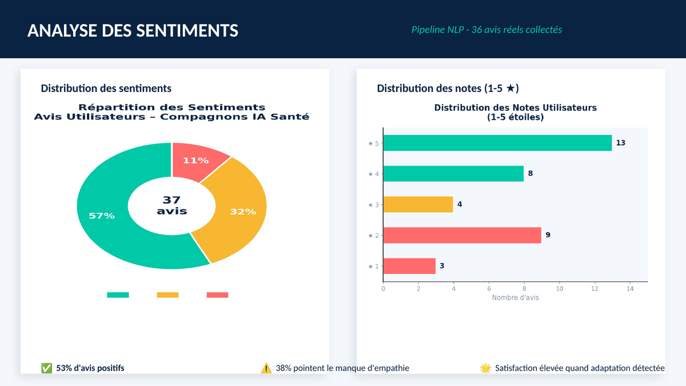
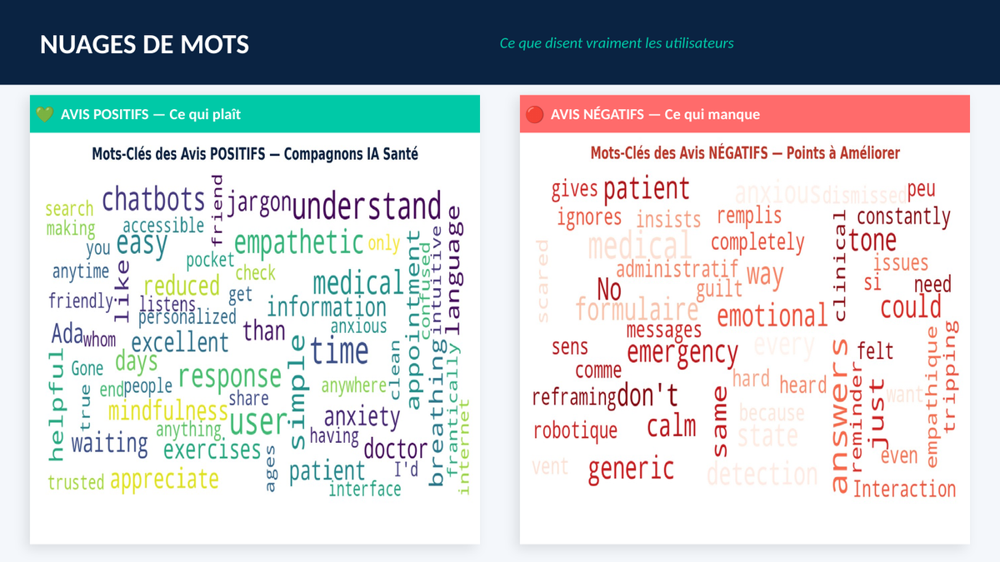
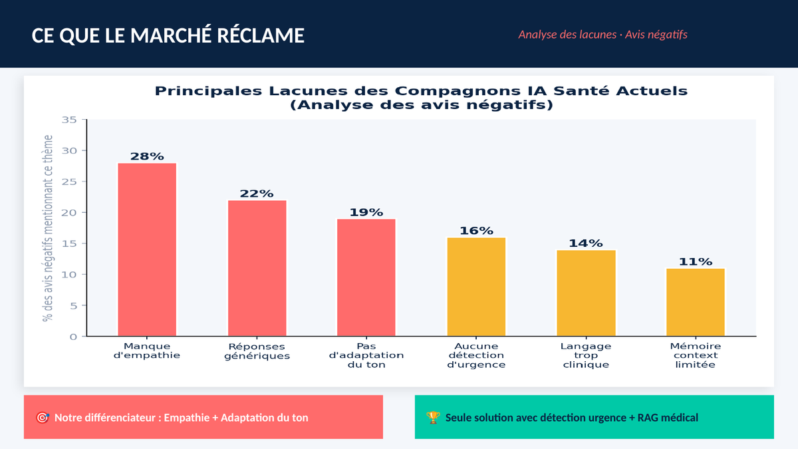
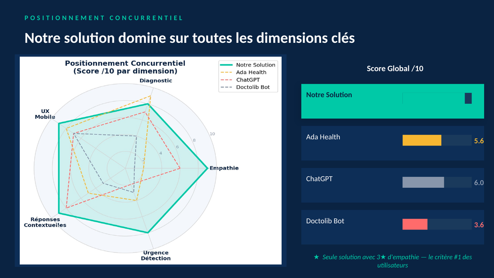
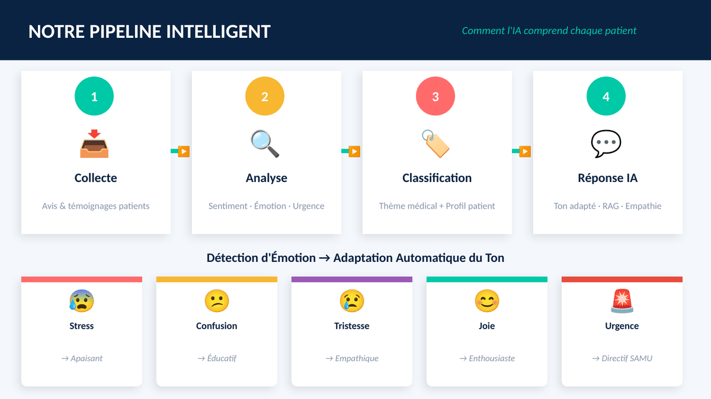
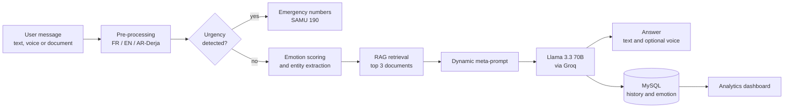

# 🩺 AI Health Companion

**An empathetic, multilingual health assistant that understands emotions, detects emergencies and answers from verified medical sources.**

`NLP` · `RAG` · `LLM (Llama 3.3 70B)` · `Emotion analysis` · `FR / EN / AR (Derja)` · `Voice` · `Vision`

> Master's project (M1 Big Data, UGC & Marketing course, IHEC Carthage, 2025–2026),
> ⚠️ **Educational project, not a medical device.** The assistant never gives a definitive diagnosis.

---

## 📌 Table of contents
1. [Why this project?](#-why-this-project)
2. [Market & user analysis](#-market--user-analysis)
3. [The knowledge base](#-the-knowledge-base)
4. [How it works](#-how-it-works)
5. [AI & ML components](#-ai--ml-components)
6. [Features](#-features)
7. [Tech stack](#-tech-stack)
8. [Limitations & roadmap](#-limitations--roadmap)
9. [Getting started](#-getting-started)
10. [Project structure](#-project-structure)
11. [Ethics & privacy](#-ethics--privacy)

---

## 💡 Why this project?

People often turn to the internet before seeing a doctor, and the result is frequently **anxiety** (cyberchondria) rather than clarity. Existing chatbots are either clinical and robotic, purely transactional, or not built for health at all.

We built a companion that:
- **understands the patient's emotional state** and adapts its tone (soothing, directive or explanatory);
- **detects emergencies** and immediately shows emergency numbers (SAMU 190 in Tunisia);
- **answers from curated medical documents** (RAG) instead of improvising, to limit hallucinations;
- **speaks the patient's language**: French, English, Arabic and Tunisian Derja.

---

## 📊 Market & user analysis

Before writing any code, we ran a **data-driven analysis** (Python notebook) of the market and of what users actually say about existing AI health companions. It shaped every design decision below.

### Who is it for?
<p align="center"></p>

Three personas (a worried parent, a retired person who struggles with medical jargon, a student looking for quick answers) led to **three adaptive tones**: reassuring, pedagogical, and practical.

### What the data says

<table>
<tr>
<td width="50%"><br><sub><b>A growing market:</b> estimated $208B by 2030 (+37% CAGR, study estimates).</sub></td>
<td width="50%"><br><sub><b>Sentiment analysis</b> of 37 real user reviews: 57% positive, 21 reviews rated 4–5★.</sub></td>
</tr>
<tr>
<td width="50%"><br><sub><b>Word clouds:</b> users love simple, empathetic language; they miss emergency handling and warmth.</sub></td>
<td width="50%"><br><sub><b>Gap analysis:</b> share of negative reviews mentioning each issue.</sub></td>
</tr>
<tr>
<td width="50%"><br><sub><b>Competitive benchmark</b> (qualitative scoring) against Ada Health, ChatGPT and a booking bot.</sub></td>
<td width="50%"><br><sub><b>NLP pipeline:</b> emotion detection drives automatic tone adaptation.</sub></td>
</tr>
</table>

*Charts are taken from the project presentation (in French).*

### Key findings → design decisions

| Finding from the analysis | Design decision |
|---|---|
| **Lack of empathy** is the #1 complaint (28% of negative reviews) | Emotion detection (joy, stress, sadness, confusion) injected into every prompt |
| **Generic answers** (22%) and **no tone adaptation** (19%) | Dynamic prompt with user profile + emotional state + retrieved facts |
| **No urgency detection** (16%) | Priority emergency scan that bypasses the LLM and shows emergency numbers |
| **Language too clinical** (14%) | Pedagogical tone that simplifies medical jargon |
| **Limited context memory** (11%) | Conversation history stored per user and reloaded on reconnection |

---

## 🗃️ The knowledge base

The quality of a RAG system depends on its documents, so we built a **hybrid "golden dataset" of 130 curated entities** in JSON.

- **Factual articles** from authoritative sources: WHO, Mayo Clinic, Vidal, Institut Pasteur de Tunis, Tunisian Ministry of Public Health, ONFP and emergency protocols of Tunisian university hospitals.
- **Simulated user-generated content** (patient questions and testimonials) to test how the system handles imprecise, emotional language.
- **Local and multilingual**: French, English, classical Arabic and **Tunisian Derja**, including local conditions (leishmaniasis, thalassemia) and national health infrastructure.
- **Structured metadata**: ID, source (traceability), and semantic tags (e.g. `#Diabetes`, `#Emergency`, `#Pediatrics`) used by the retrieval step.

All user-generated content is **synthetic**: no real patient data was used.

---

## ⚙️ How it works



1. **Pre-processing**: cleaning, lowercasing, punctuation removal, handling of French, Arabic and Derja.
2. **Urgency check**: a priority scan for vital-distress terms (chest pain, heart attack, bleeding...). If triggered, the system skips everything else and shows emergency numbers.
3. **Emotion analysis**: weighted keyword scoring into 4 categories (joy, stress, sadness, confusion), with a neutral fallback and a tie-break in favor of the most critical emotion (stress).
4. **Entity extraction**: symptoms, organs and medications mentioned, used to personalize the answer.
5. **Retrieval (RAG)**: stop-word filtering, keyword-overlap scoring against article content and tags (tags weigh more), top 3 documents kept.
6. **Prompt construction**: system instructions (empathetic companion, never a definitive diagnosis), emotional state, retrieved facts, user profile, and the language to answer in.
7. **Generation**: Llama 3.3 70B through the Groq API.
8. **Persistence**: every message is stored with its detected emotion, so the dashboard does not need to recompute it.

---

## 🧠 AI & ML components

| Component | Technique | Purpose |
|---|---|---|
| Market & review analysis | Python notebook: sentiment analysis, rating distribution, word clouds, gap analysis, benchmark | Ground the product in real user needs |
| Emotion detection | Weighted keyword scoring (multilingual dictionaries, including Derja phonetic expressions) | Adapt the tone; drive the avatar's expression |
| Urgency detection | Priority keyword scan, bypasses the LLM | Safety first |
| Entity extraction | Dictionary-based NER (symptoms, organs, medications) | Personalize answers |
| Retrieval (RAG) | Keyword-overlap scoring with tag weighting, top-K = 3 | Ground answers in verified documents |
| Generation | Llama 3.3 70B (Groq) with dynamic prompt engineering | Natural, multilingual, empathetic answers |
| Document understanding | PDF to image (PyMuPDF), then vision LLM (Llama 3.2 Vision, then Llama 4 Scout) | Explain prescriptions |
| Speech | Whisper (speech-to-text), gTTS (text-to-speech) | Voice interaction |
| Analytics | Emotion and topic trends over time | Preventive follow-up |

> **Design choice:** Derja is poorly supported by standard NLP libraries such as spaCy, so we built custom multilingual dictionaries rather than relying on a pretrained model.

---

## ✨ Features

- 🗣️ **Empathetic conversation** with tone adapted to the detected emotion
- 🚨 **Emergency detection** with immediate emergency numbers
- 📚 **Answers grounded in curated medical sources**
- 🌍 **Multilingual**: interface, understanding and answers in French, English and Arabic (Derja included)
- 🎙️ **Voice**: speak to the assistant and hear the answer
- 📄 **Prescription reading**: upload a document and get a plain-language explanation
- 🧠 **Memory**: conversation history and user profile
- 🔐 **Secure accounts** with JWT authentication
- 📈 **Dashboard**: evolution of emotional state and health topics

---

## 🛠️ Tech stack

| Layer | Technologies |
|---|---|
| **Language models** | Llama 3.3 70B, Llama 3.2 Vision / Llama 4 Scout (via Groq), Whisper, gTTS |
| **Backend** | Python, REST API, SQLAlchemy, PyMuPDF |
| **Database** | MySQL |
| **Auth** | JWT |
| **Frontend** | React, Recharts / Chart.js |
| **Analysis** | Python notebook (sentiment analysis, visualizations) |

---

## ⚠️ Limitations & roadmap

**Current limitations** (we prefer to be transparent):
- Emotion detection and entity extraction are **rule-based** (weighted dictionaries), not trained classifiers.
- Retrieval uses **keyword scoring**, not embeddings, so semantic matches without shared words can be missed.
- The knowledge base is small (130 entities) and user content is simulated.
- No quantitative evaluation of the NLP components yet.

**Roadmap:**
- [ ] Replace keyword retrieval with **embeddings and a vector database** (e.g. ChromaDB)
- [ ] Train and evaluate an **emotion classifier** on a labeled multilingual dataset
- [ ] Build an **evaluation set** (urgency recall, answer faithfulness to sources)
- [ ] Extend the corpus and validate answers with medical professionals

---

## 🚀 Getting started

<!-- Adapt these commands to the real repository (file names, scripts, environment variables). -->

```bash
# 1. Clone the repository
git clone https://github.com/MolkaJebali/<repo-name>.git
cd <repo-name>

# 2. Backend
cd backend
pip install -r requirements.txt
cp .env.example .env        # add your Groq API key, MySQL credentials and JWT secret
python server.py

# 3. Frontend
cd ../frontend
npm install
npm run dev
```

> Never commit your `.env` file or API keys.

---

## 📁 Project structure

```
├── backend/
│   ├── server.py            # API endpoints (chat, document analysis, ...)
│   └── src/
│       ├── nlp_emotion.py   # preprocessing, urgency, emotion scoring, entities
│       ├── llm_rag.py       # retrieval and prompt construction
│       ├── database.py      # users, conversations, messages (MySQL)
│       └── auth.py          # JWT authentication
├── frontend/
│   └── src/components/
│       └── Chat.jsx         # chat interface, translations, dashboard
├── notebooks/               # market and sentiment analysis
└── assets/                  # images used in this README
```

---

## 🔒 Ethics & privacy

- **Not medical advice.** The assistant is instructed never to give a definitive diagnosis and to direct users to professionals.
- **Synthetic data only.** No real patient data is used, in line with GDPR principles.
- **Traceability.** Every knowledge-base entry keeps its source.
- **Security.** Health data is tied to authenticated accounts (JWT).

---

## 👩‍💻 Author

**Molka Jebali**: [GitHub](https://github.com/MolkaJebali) · [LinkedIn](https://www.linkedin.com/in/jebali-molka)
