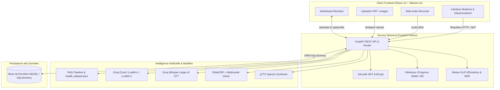

<div align="center">

# 🩺 Santé-IA — Compagnon Intelligent de Santé & Analyse Médicale

<p align="center">
  <strong>Assistant médical conversationnel multimodal, analyseur de documents cliniques et suivi émotionnel en temps réel.</strong>
</p>

<p align="center">
  
  
  
  
  
  
  
  
</p>

</div>

---

## 📌 Présentation du Projet

**Santé-IA** est une plateforme e-santé complète conçue pour démocratiser l'accès à l'information médicale, offrir un soutien empathique aux patients et simplifier la compréhension des documents de santé (ordonnances, bilans sanguins, comptes rendus radiologiques).

Développée dans le cadre académique du **Master 1 Big Data**, la solution combine :
- Un pipeline **RAG (Retrieval-Augmented Generation)** alimenté par une base de connaissances médicales vérifiées.
- Un système de **détection d'émotions et de détresse psychologique** en temps réel (Français, Anglais, Arabe / Derja).
- Une **analyse multimodale de documents cliniques** (Vision par ordinateur & OCR PDF via PyMuPDF et LLM Vision).
- Un protocole strict de **détection d'urgences vitales** avec redirection immédiate vers les services de secours (SAMU 190, Protection Civile 198 en Tunisie).
- Une interaction vocale bidirectionnelle (**STT Whisper** + **TTS vocal synthétisé**).
- Un **tableau de bord analytique** assurant le suivi longitudinal de l'état émotionnel et du profil médical du patient.

---

## 🚀 Fonctionnalités Clés

### 1. 🤖 Assistant Médical & RAG Hybride
- Réponse contextualisée basée sur le profil patient (âge, groupe sanguin, allergies, antécédents chroniques).
- Base de connaissances médicales indexée (`health_dataset.json`) pour limiter les hallucinations et garantir des conseils rigoureux.
- Personnalisation empathique du ton en fonction de l'interlocuteur.

### 2. 🎭 Analyse Émotionnelle Multilingue & Avatar Dynamique
- Classification en 5 états émotionnels : **Stress**, **Tristesse**, **Joie**, **Neutre**, **Confusion**.
- Support trilingue natif incluant le dialecte tunisien (Derja) et l'arabe standard.
- L'avatar de l'interface adapte son expression visuelle en temps réel selon l'émotion dominante détectée.

### 3. 🚨 Détection Automatique d'Urgences Vitales
- Analyse lexicale immédiate identifiant les signaux critiques (douleur thoracique, suspicion d'infarctus, hémorragie, détresse respiratoire, pensées suicidaires).
- Interruption préventive du chat avec affichage prioritaire d'alerte et appel direct aux numéros d'urgence :
  - **SAMU :** `190`
  - **Protection Civile :** `198`
  - **Police Secours :** `197`

### 4. 📄 Vision & Analyse Intelligente d'Ordonnances / Bilans (PDF & Images)
- Import de photos d'ordonnances ou de documents PDF multipages.
- Extraction de texte et rendu haute résolution via **PyMuPDF (`fitz`)**.
- Analyse par modèle de vision multimodal (**Meta LLaMA Vision**) pour vulgariser la posologie, expliquer les indicateurs anormaux et rassurer le patient.

### 5. 🎙️ Consultation Vocale (Speech-to-Text & Text-to-Speech)
- Enregistrement audio intégré dans le navigateur via l'API Web MediaRecorder.
- Transcription ultra-rapide par **Groq Whisper Large v3**.
- Synthèse vocale fluide (**gTTS**) renvoyée en Base64 pour écoute directe de la réponse.

### 6. 📈 Dashboard de Santé & Suivi Émotionnel
- Visualisation interactive avec **Recharts** (camemberts de distribution des émotions, compteurs d'échanges).
- Synthèse de la fiche santé personnelle (groupe sanguin, allergies, affections chroniques).
- Gestion complète de l'historique des discussions (création, renommage, suppression).

### 7. 🌍 Internationalisation & Accessibilité
- Support complet du **Français**, de l'**Anglais** et de l'**Arabe** (avec direction d'écriture **RTL** native).
- Mode **Invité** pour une consultation immédiate sans inscription et mode **Authentifié (JWT)** pour le suivi longitudinal.

---

## 🏗️ Architecture du Système



---

## 💻 Technologies Utilisées

| Domaine | Technologies |
| :--- | :--- |
| **Frontend** | React 19, Vite, Tailwind CSS v4, Recharts, Lucide Icons |
| **Backend** | Python 3.10, FastAPI, Uvicorn, Pydantic, SQLAlchemy, PyMySQL |
| **Sécurité** | JWT (JSON Web Tokens), Passlib (Bcrypt), OAuth2 Bearer |
| **Intelligence Artificielle** | Groq Cloud API, LLaMA Models, Whisper Large-v3, LangChain (RAG) |
| **Traitement du Document & Audio** | PyMuPDF (fitz), gTTS (Google Text-to-Speech), SpeechRecognition |
| **Base de Données** | MySQL 8.0 / MariaDB (compatible XAMPP et Docker) |
| **DevOps & Conteneurisation** | Docker, Docker Compose |

---

## 📁 Structure du Répertoire

```bash
Sant--IA/
├── backend/
│   ├── data/
│   │   └── health_dataset.json      # Base de connaissances médicale pour le RAG
│   ├── src/
│   │   ├── auth.py                  # Gestion JWT, hachage de mot de passe & dépendances
│   │   ├── database.py              # Schéma SQLAlchemy (User, Conversation, Message)
│   │   ├── llm_rag.py               # Pipeline RAG, client Groq et génération de prompts
│   │   └── nlp_emotion.py           # Analyse d'émotions, NER et détection d'urgences
│   ├── server.py                    # Point d'entrée FastAPI et ensemble des routes API
│   ├── migrate_db.py                # Scripts d'initialisation et de migration BDD
│   ├── seed_demo_data.py            # Données de démonstration pour tests
│   └── requirements.txt             # Dépendances Python
│
├── frontend/
│   ├── src/
│   │   ├── components/
│   │   │   ├── AuthForm.jsx         # Formulaire d'authentification et mode invité
│   │   │   ├── Chat.jsx             # Fenêtre principale de discussion & avatar adaptatif
│   │   │   ├── Dashboard.jsx        # Visualisation analytique des émotions (Recharts)
│   │   │   ├── ProfileModal.jsx     # Fiche médicale et informations personnelles
│   │   │   └── Sidebar.jsx          # Historique des chats, sélecteur de langue & navigation
│   │   ├── App.jsx                  # Assemblage des composants et gestion d'état globale
│   │   └── main.jsx                 # Point de montage React
│   ├── package.json                 # Dépendances Node & scripts Vite
│   └── vite.config.js               # Configuration du proxy API Vite
│
├── docker-compose.yml               # Déploiement multi-conteneur (FastAPI + MySQL)
├── Dockerfile                       # Image de production pour le backend
├── .env.example                     # Modèle des variables d'environnement
├── .gitignore                       # Exclusion des caches, dépendances et secrets
└── README.md                        # Documentation du projet
```

---

## 🛠️ Guide d'Installation & Démarrage

### Prérequis
- [Python 3.10+](https://www.python.org/)
- [Node.js 18+](https://nodejs.org/) & `npm`
- [MySQL 8.0](https://www.mysql.com/) (ou un serveur XAMPP actif) ou [Docker](https://www.docker.com/)
- Une clé API gratuite [Groq Cloud](https://console.groq.com/)

---

### Option 1 : Lancement Manuel (Développement)

#### 1. Configuration des variables d'environnement
Créez un fichier `.env` dans le dossier `backend/` :

```env
GROQ_API_KEY=votre_cle_api_groq
DATABASE_URL=mysql+pymysql://root:@localhost:3306/health_db
JWT_SECRET=votre_cle_secrete_jwt_personnalisee
```

> **Note MySQL :** Assurez-vous d'avoir créé la base `health_db` au préalable dans votre gestionnaire MySQL (phpMyAdmin ou CLI) :
> ```sql
> CREATE DATABASE health_db CHARACTER SET utf8mb4 COLLATE utf8mb4_unicode_ci;
> ```

#### 2. Démarrer le Backend FastAPI
```bash
# Se placer dans le dossier backend
cd backend

# Créer et activer un environnement virtuel
python -m venv venv
# Sur Windows :
.\venv\Scripts\activate
# Sur Linux/Mac :
# source venv/bin/activate

# Installer les dépendances
pip install -r requirements.txt

# Lancer le serveur FastAPI
uvicorn server:app --reload --host 0.0.0.0 --port 8000
```
Le backend est accessible sur : `http://localhost:8000`  
Documentation interactive Swagger : `http://localhost:8000/docs`

#### 3. Démarrer le Frontend React
Dans un second terminal :
```bash
# Se placer dans le dossier frontend
cd frontend

# Installer les dépendances
npm install

# Démarrer le serveur de développement Vite
npm run dev
```
L'interface utilisateur est accessible sur : `http://localhost:5173`

---

### Option 2 : Lancement avec Docker Compose

Pour un déploiement clé en main orchestré avec MySQL :

```bash
# À la racine du projet
docker-compose up --build
```

---

## 🔌 Référence des Endpoints API

| Méthode | Endpoint | Description | Authentification |
| :--- | :--- | :--- | :---: |
| `POST` | `/api/auth/signup` | Inscription d'un nouvel utilisateur avec profil médical | ❌ |
| `POST` | `/api/auth/login` | Connexion et génération du Bearer Token JWT | ❌ |
| `GET` | `/api/auth/me` | Récupération du profil de l'utilisateur connecté | 🔒 Requis |
| `PUT` | `/api/auth/profile` | Mise à jour des informations médicales (groupe, allergies, etc.) | 🔒 Requis |
| `POST` | `/api/chat` | Envoi d'un message, analyse d'émotion, RAG & réponse vocale | Optionnel |
| `POST` | `/api/audio` | Transcription vocale (Groq Whisper Large v3) | Optionnel |
| `POST` | `/api/analyze-document` | Analyse visuelle et explicative d'un rapport ou d'une ordonnance | Optionnel |
| `GET` | `/api/stats` | Données agrégées des émotions pour le dashboard Recharts | 🔒 Requis |
| `GET` | `/api/conversations` | Liste des sessions de discussion de l'utilisateur | 🔒 Requis |
| `POST` | `/api/conversations` | Création d'une nouvelle session de discussion | 🔒 Requis |
| `DELETE`| `/api/conversations/{id}` | Suppression définitive d'une discussion | 🔒 Requis |

---

## 🛡️ Confidentialité & Avertissement Médical

> [!WARNING]
> **Santé-IA est un outil d'assistance et de sensibilisation technologique.** Il ne remplace en aucun cas l'avis, le diagnostic ou la prescription d'un médecin ou d'un professionnel de santé qualifié. En cas d'urgence médicale vitale, contactez immédiatement le **190** (SAMU) ou rendez-vous au service d'urgences le plus proche.

---

## 👩‍💻 Auteur

<div align="center">

**Molka Jebali**  

[](https://github.com/MolkaJebali)

</div>

---

<div align="center">
  Projet Santé-IA • Développé avec passion pour l'innovation en e-Santé © 2025-2026
</div>
